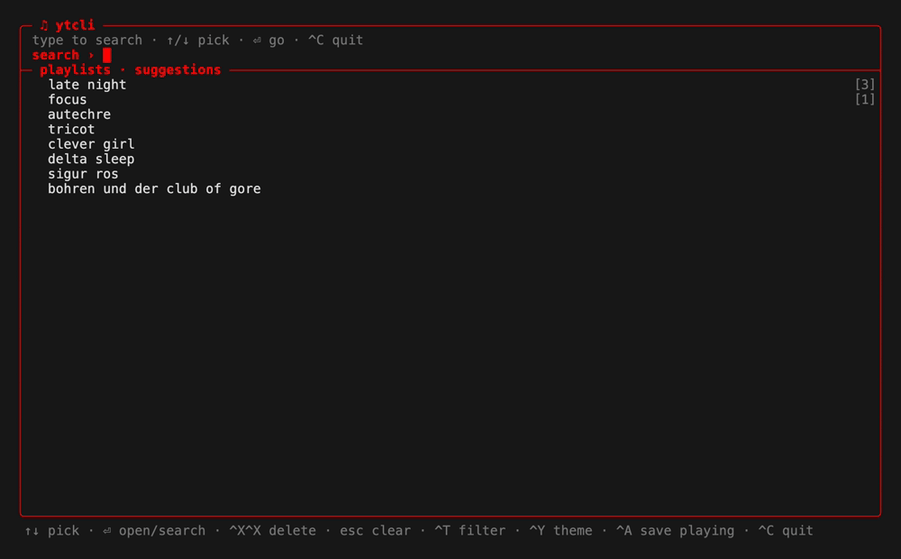

# ytcli
TUI client for yt music<br>
search, browse, and play from your terminal

<p align="center">
  
</p>

<p align="center">
  
  
</p>

zig 0.16, single binary
- `libmpv` for audio
- shells out to `curl` and
`yt-dlp`<br>
- astats lavfi filter for visualizer via `ffmpeg`

## version
<b>v0.1.5</b>
- **playlists**: build as you browse: `P` saves the selected result, `Ctrl+A` saves whatever is playing; create a new list or add to an existing list
- your playlists sit above recent searches on the search screen
- `Ctrl+X` twice deletes the selected playlist *or* forgets the selected past search; `d`/`Ctrl+X` removes a track from an open playlist
- `ytcli playlists [name]` prints them for piping
- CJK/emoji titles no longer break the layout
- long queries scroll with the cursor instead of vanishing off the edge
- 5 new themes (tokyonight, catppuccin, matrix, rosepine, solarized)
- frames drawn inside synchronized output — no tearing on theme switch
- recoverable failures land in log and status bar instead of dropping you out
<details>
<summary>previous</summary><br>

<b>v0.1.4</b><br>
- `m` mute toggle (now-playing meter reads `mute`, visualizer idles while muted)<br>
- `Ctrl+R` repeat mode: off → track → queue (autoplay loops per mode)<br>
- volume persists across sessions (saved to config alongside theme)<br>
- tracks over an hour render `h:mm:ss`

<b>v0.1.3</b><br>
- selecting a track stops audio immediately + shows `connecting to YouTube…` in the now-playing footer<br>
- fix album view mislabeling tracks with a related artist (reads album header, not first channel link)<br>
- fix freeBSD release build (zig 0.16 translate-c: headers pulling `<sys/time.h>`, and `__ssp` fortify wrappers → `std.c` + `_FORTIFY_SOURCE=0`)<br>
- macOS release is now one universal binary (arm64 + x86_64), cross-built + `lipo`'d on a single runner<br>
- release CI `timeout-minutes`

<b>v0.1.2</b><br>
+ failures log to `~/.local/share/ytcli/log` (timestamp + cause)<br>
+ ctrl+c restores cleanly to terminal in all cases<br>
+ play video ids beginning with `-` (yt-dlp `--` arg fix)<br>
+ fix freeBSD build (terminal size via std, not `<sys/ioctl.h>`)<br>
+ readme fix: `brew install mpv` already pulls in `yt-dlp`, `libmpv-dev` however does not

<b>v0.1.1</b><br>
+ github actions for release builds<br>
+ prebuilt binaries: macOS, linux, freeBSD<br>
+ hardened temp writes (mkstemp, 0600)

<b>v0.1</b><br>
+ autoplays through result list
+ drills into albums
+ handful of color themes
</details>

## build/install
```sh
zig build                              # → zig-out/bin/ytcli
zig build install --prefix ~/.local    # → ~/.local/bin/ytcli
```
## dependencies

```sh
install ex.
brew install mpv ffmpeg                # macOS (mpv pulls in yt-dlp)
apt install libmpv-dev yt-dlp ffmpeg   # Debian/Ubuntu
```
<br>

> **[ ! ]** currently requires `mpv`, `ffmpeg` and `yt-dlp` particularly on PATH

## releases

macOS (universal: arm64 + x86_64), Linux (arm64/x86_64), and FreeBSD binaries are attached to each [release](../../releases). windows: run under WSL (no native build currently).

## run
```sh
ytcli               # TUI
ytcli <query>       # play first hit
ytcli -s <query>    # search, print results
ytcli history       # past queries
ytcli playlists     # saved playlists (add a name to print its tracks)
ytcli --theme cyan  # red (default) | cyan | mono | dracula | nord | gruvbox
                    # tokyonight | catppuccin | matrix | rosepine | solarized
ytcli --themes      # list themes
ytcli -h | -v
```

## commands

made an effort to use commands that felt intuitive

<details>
<summary>view</summary><br>

**search screen:** (your playlists, then recent searches — one list)
- text to query, `↑/↓` move
- `⏎` opens the selected playlist, or searches the selected/typed query
- `tab`/`→` accept completion (or open the selected playlist)
- `Ctrl+X` twice — deletes the selected playlist, or forgets the selected past search
- `esc` clear
- `Ctrl+T` cycle filter (all/songs/videos/albums/artists)

**results:**
 - `j/k` or `↑/↓` move
 - `g/G` top/end
 - `Ctrl+F/B` page
 -  `h`/`esc` back
 - `P` save to a playlist — never starts playback (pick one, or type a name for a new one)

**inside a playlist:**
- `⏎`/`l` play, queueing the rest of the list
- `d` or `Ctrl+X` remove the selected track
- `P` copy it into another playlist
- `Ctrl+A` saves whatever is playing, from any screen

**playback/anytime:**
- `Ctrl+P`/`space` pause
- `Ctrl+N` next
- `Ctrl+S` stop
- `[`/`]` seek ±10s
- `{`/`}` ±60s
- `-`/`=` volume ±5 (persists)
- `m` mute
- `Ctrl+R` repeat (off/track/queue)
- `Ctrl+Y` theme
</details>

## storage/config
- `$XDG_DATA_HOME/ytcli/history` - query log (falls back to `~/.local/share/ytcli/history`).
- `$XDG_DATA_HOME/ytcli/log` - timestamped failures (search/album/stream) with the underlying error and any `curl`/`yt-dlp` stderr. check here first when something says `(see log)`.
- `$XDG_DATA_HOME/ytcli/playlists` - saved playlists: `[name]` header, then one `video_id⇥title⇥artist⇥kind` line per track. tab-separated, editable by hand.
- `$XDG_CONFIG_HOME/ytcli/config` - `key=value` settings.

history is just newline-delimited text - `grep`/`cat` it, or seed it so the TUI autocompletes your favorites from the first keystroke:
```sh
ex.
printf '%s\n' "elephant gym" "autechre" "john zorn" >> ~/.local/share/ytcli/history
grep -i jazz ~/.local/share/ytcli/history
```
> [ ! ] loads newest-first and dedups, so re-seeding or reordering is harmless.

`ytcli -s <query>` prints `title — artist [video_id]`, one per line; pipe it anywhere. `YTCLI_THEME` sets the theme without a flag.

> [ ! ] requests written to `/tmp/ytcli_body*` (mkstemp, 0600, unlinked after) per call + audio streamed/buffered via mpv; not written to disk.

## visualizer
simple spectrum bars via `astats` lavfi filter<br>
dB to linear/modulated per bar - *not a true per-band FFT*

## contribution
please feel free to contribute, not a guarantee it will be merged<br>

> [ ! ] thank you for your attention

