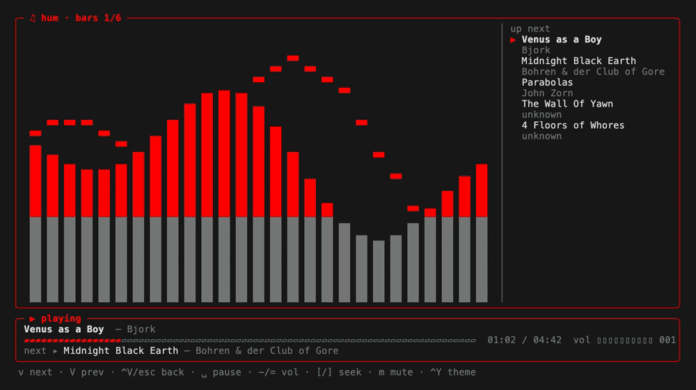

# hum
your local music library, streamed rss/urls, and yt music, one zig binary that runs in your terminal

<p align="center">
  
</p>

<p align="center">
  
  
</p>

zig 0.17, single binary
- `libmpv` for audio, loaded at runtime; plays local files, streams, and youtube
- `hum` now has it's own tag reader (id3, vorbis/flac, ogg/opus, mp4) | no taglib, no ffprobe
- shells out to `curl` and `yt-dlp` **for youtube obviously**; local playback needs neither
- astats lavfi filter for visualizer (ffmpeg inside mpv)
- outbound calls only: never listens on a socket

## version
<b>v0.1.8</b> visualizers, mouse, and installs anywhere mpv does
- **libmpv loads at runtime** instead of being linked: one binary per platform, and intel macs get a release again (universal macOS binary)
- no mpv? `hum` still starts, searches and browses, and tells you to install mpv instead of failing to launch
- **mp3 durations**: local mp3s without a `TLEN` tag showed `00:00`; length now comes from the Xing/Info header, or bytes ÷ bitrate for CBR. existing library rows refresh on the next scan
- **linux media keys / status bars** (MPRIS): install `mpv-mpris` and hum shows up in waybar, polybar, gnome, kde
- now-playing widgets (macOS Now Playing, MPRIS) show the track title instead of a stream URL
- `hum doctor` reports where libmpv was found and flags a stale `yt-dlp`; the TUI says so too when a youtube track fails because of it
- **visualizer view** (`Ctrl+V`): the visualizer takes over the main box while now playing stays below, and the queue sits beside it on wide terminals. five built in: bars, cube, orbit, rings, plasma. `v`/`V` cycles them. they follow your theme and react to loudness, left/right balance and brightness (treble). resize all you want; it lays out fresh every frame
- **your own visualizers**: drop a `.vis` text file (ascii frames + a few `key = value` lines) in `~/.config/hum/visualizers/` and it joins the cycle. see [`examples/visualizers/pulse.vis`](examples/visualizers/pulse.vis)
- **mouse**: wheel scrolls lists, click selects, click again plays, click the progress bar to seek, click `both`/`youtube`/`library` and `all`/`songs`/… to switch scope and filter. in the visualizer: left/right click cycles, the queue panel plays on click and reorders by drag. `mouse=off` in the config turns it off (hold `shift`, or `option` in macOS Terminal, to select text while it's on)
- **paste**: pasting into search goes in as text (bracketed paste), so a pasted newline or escape code can't fire keys
- **zig 0.17**: builds with current zig (and homebrew's), no more C header imports anywhere
- `brew install zblauser/tap/hum` installs the prebuilt binary instead of compiling: intel macs no longer build zig (and LLVM) from source first

<details>
<summary>previous</summary><br>

<b>v0.1.7</b><br>
dropping out the `ytcli` name; it's a media player now and youtube is only one source
- **renamed**: the binary is `hum`. your existing history, playlists and config keep working; it does read the old `ytcli/` config/data dirs when the new `hum/` ones aren't present
- **local files**: `hum ~/Music/album/01.flac` plays a file; `http(s)://` URL streams
- **local library**: `hum library dir ~/Music`, then `Ctrl+L` in the TUI browses artists → albums → tracks
- **tags read**: id3v2.3/2.4, vorbis comments (flac), ogg/opus (mp4 falls back to `Artist/Album/01 Title.flac` path layout when a file has none)
- **local hits while you type**: your library appears above recent searches, tagged `[local]`
- **queue view** (`Ctrl+Q`): `K`/`J` reorder, `d` remove, `⏎` jump; `a`/`A` queue from any list
- playlists hold local tracks and youtube tracks side by side (older playlist files keep working)
- scanning is on demand with progress, and any key stops it (a stopped scan is never cached as if complete)
- fix: search rows showed a duration where the artist belongs (top-result rows come from a card shelf that carries the artist in its header)
- dropped: cookie/SAPISIDHASH personalization. not worth the credential surface

<b>v0.1.6</b><br>
- fix crash on non-UTF-8 autocomplete (the suggest endpoint answers in latin-1 without `ie`/`oe=utf-8`)
- remote text is scrubbed of control bytes before it reaches your terminal or your history/playlist files
- autoplay skips rows with no video id instead of calling `yt-dlp` with an empty one
- your history file keeps one line per search instead of piling up duplicates
- a stream that fails to open now says so in the status bar instead of sitting at `00:00`
- `curl`/`yt-dlp` calls now have timeouts and an output cap
- playback needs a current `yt-dlp`: stale versions get 403'd by youtube and sit at `00:00`

<b>v0.1.5</b><br>
- **playlists**: build as you browse: `P` saves the selected result, `Ctrl+A` saves whatever is playing; create a new list or add to an existing list
- your playlists sit above recent searches on the search screen
- `Ctrl+X` twice deletes the selected playlist *or* forgets the selected past search; `d`/`Ctrl+X` removes a track from an open playlist
- `hum playlists [name]` prints them for piping
- CJK/emoji titles no longer break the layout
- long queries scroll with the cursor instead of vanishing off the edge
- 5 new themes (tokyonight, catppuccin, matrix, rosepine, solarized)
- frames drawn inside synchronized output — no tearing on theme switch
- recoverable failures land in log and status bar instead of dropping you out

<b>v0.1.4</b><br>
- `m` mute toggle (now-playing meter reads `mute`, visualizer idles while muted)<br>
- `Ctrl+R` repeat mode: off → track → queue (autoplay loops per mode)<br>
- volume persists across sessions (saved to config alongside theme)<br>
- tracks over an hour render `h:mm:ss`

<b>v0.1.3</b><br>
- selecting a track stops audio immediately + shows `connecting to YouTube…` in the now-playing footer<br>
- fix album view mislabeling tracks with a related artist (reads album header, not first channel link)<br>
- fix freeBSD release build (zig 0.16 translate-c: headers pulling `<sys/time.h>`, and `__ssp` fortify wrappers → `std.c` + `_FORTIFY_SOURCE=0`)<br>
- macOS release is now one universal binary (arm64 + x86_64), cross-built + `lipo`'d on a single runner<br>
- release CI `timeout-minutes`

<b>v0.1.2</b><br>
+ failures log to `~/.local/share/hum/log` (timestamp + cause)<br>
+ ctrl+c restores cleanly to terminal in all cases<br>
+ play video ids beginning with `-` (yt-dlp `--` arg fix)<br>
+ fix freeBSD build (terminal size via std, not `<sys/ioctl.h>`)<br>
+ readme fix: `brew install mpv` already pulls in `yt-dlp`, `libmpv-dev` however does not

<b>v0.1.1</b><br>
+ github actions for release builds<br>
+ prebuilt binaries: macOS, linux, freeBSD<br>
+ hardened temp writes (mkstemp, 0600)

<b>v0.1</b><br>
+ autoplays through result list
+ drills into albums
+ handful of color themes
</details>

## install
```sh
brew install zblauser/tap/hum          # macOS / linuxbrew: prebuilt binary + mpv + yt-dlp, nothing to compile
```
or grab a binary from [releases](../../releases): macOS (universal), Linux (arm64/x86_64), FreeBSD. windows: run under WSL (no native build just yet).

## dependencies

```sh
brew install mpv                       # macOS (mpv pulls in yt-dlp)
apt install libmpv2 yt-dlp             # Debian/Ubuntu
apt install mpv-mpris                  # optional: media keys + status bar widgets on linux
```
<br>

> **[ ! ]** `libmpv` plays everything; `yt-dlp` is only for youtube (try and keep it updated, youtube breaks old versions). `hum doctor` checks both

## build
```sh
zig build                              # → zig-out/bin/hum (needs only zig 0.17, not mpv)
zig build install --prefix ~/.local    # → ~/.local/bin/hum
```

## run
```sh
hum                       # TUI
hum <query>               # play first hit
hum <file|url>            # play a local file or a stream URL
hum -s <query>            # search, print results
hum library               # list the local library
hum library scan          # re-read tags for anything that changed
hum library dir ~/Music   # set the music folder (colon-separate several)
hum feeds                 # podcast subscriptions
hum feeds add <url>       # subscribe to an RSS/Atom feed
hum feeds <name>          # print a show's episodes (title, length, url)
hum doctor                # paths, settings, deps — paste this into a bug report
hum history               # past queries
hum playlists             # saved playlists (add a name to print its tracks)
hum --theme cyan          # red (default) | cyan | mono | dracula | nord | gruvbox
                          # tokyonight | catppuccin | matrix | rosepine | solarized
hum --themes              # list themes
hum -h | -v
```

## commands

made an effort to use commands that felt fairly intuitive

<details>
<summary>view</summary><br>

| Screen / Context | Shortcuts | Action / Function |
| :--- | :--- | :--- |
| **Search Screen** | `↑` / `↓` | Move selection through unified list |
| | `⏎` | Open playlist, play local file, or search query |
| | `Tab` / `→` | Accept completion or open selected playlist |
| | `Ctrl+X` (twice) | Delete selected playlist or forget past search |
| | `esc` | Clear search input |
| | `Ctrl+T` | Cycle filter (all/songs/videos/albums/artists) |
| **Library (`Ctrl+L`)** | `Ctrl+L` | Open library screen / Rescan library |
| | Hierarchy | Navigate from Artists → Albums → Tracks |
| | `⏎` | Enter selection |
| | `h` | Go back |
| **Podcasts (`Ctrl+F`)** | `Ctrl+F` | Open subscriptions list |
| | `⏎` | Open show episode list / Play an episode |
| **Queue (`Ctrl+Q`)** | `Ctrl+Q` | Open queue screen |
| | `K` / `J` | Move the selected track |
| | `d` | Remove track from queue |
| | `s` | Shuffle tracks that haven't played yet |
| | `⏎` | Play selected track now |
| | `h` | Go back |
| **Action from Results** | `a` | Queue selection at the end |
| | `A` | Play selection next |
| **Results Navigation** | `j`/`k` or `↑`/`↓` | Move selection |
| | `g` / `G` | Jump to top / Jump to end |
| | `Ctrl+F` / `Ctrl+B` | Page down / Page up |
| | `h` / `esc` | Go back |
| | `P` | Save to a playlist (does not start playback) |
| **Inside a Playlist** | `⏎` / `l` | Play track and queue the rest of the list |
| | `d` / `Ctrl+X` | Remove selected track |
| | `P` | Copy track into another playlist |
| **Playback (Anytime)** | `Ctrl+A` | Save whatever is currently playing |
| | `Ctrl+P` / `space` | Pause playback |
| | `Ctrl+N` | Next track |
| | `Ctrl+S` | Stop playback |
| | `[` / `]` | Seek backward / forward 10 seconds |
| | `{` / `}` | Seek backward / forward 60 seconds |
| | `-` / `=` | Volume down / up by 5 (persists) |
| | `m` | Mute |
| | `Ctrl+R` | Cycle repeat mode (off/track/queue) |
| | `Ctrl+Y` | Cycle theme |
| | `Ctrl+V` | Visualizer view (`esc` or `Ctrl+V` again to leave) |
| **Visualizer (`Ctrl+V`)** | `v` / `V` | Next / previous visualizer (remembered) |
| | `↑` / `↓` | Volume up / down |
| | `←` / `→` | Seek backward / forward 10 seconds |
| **Mouse** | wheel | Move the selection (volume in the visualizer) |
| | click | Select a row; click it again to play or open it |
| | click the progress bar | Jump to that point in the track |
| | left / right click the visualizer | Next / previous visualizer |
| | click a queue-panel track | Play it |
| | drag a track onto another | Move it there (queue panel and `Ctrl+Q`) |
| | click a scope or filter label | Switch to it |

</details>

## storage/config
- `$XDG_DATA_HOME/hum/history` - query log (falls back to `~/.local/share/hum/history`).
- `$XDG_DATA_HOME/hum/log` - timestamped failures (search/album/stream) with the underlying error and any `curl`/`yt-dlp` stderr. check here first when something says `(see log)`.
- `$XDG_DATA_HOME/hum/playlists` - saved playlists: `[name]` header, then one `target⇥title⇥artist⇥kind⇥source⇥duration` line per track (`target` is a video id, or a path for local files). tab-separated, editable by hand. files written by older versions still load.
- `$XDG_CACHE_HOME/hum/library` - the local index. rebuildable. delete it and `hum library scan`. rows are reused when a file's mtime and size are unchanged, so a rescan only re-reads what actually changed.
- `$XDG_CONFIG_HOME/hum/config` - `key=value` settings (theme, volume, `music_dir`, `visualizer`, `mouse=off`, `splash=off`).
- `$XDG_CONFIG_HOME/hum/visualizers/*.vis` - your own visualizers. header lines `name`, `fps` (1-30), `speed` (`fixed`/`level`), `color` (`level`/`dim`/`accent`/`strong`), then frames separated by `---` lines. up to 32 files, 64KB each; a file that doesn't parse is skipped and noted in the log
- history is just newline delimited text - `grep`/`cat` it, or seed it so the TUI autocompletes your favorites from the first keystroke:
```sh
printf '%s\n' "elephant gym" "autechre" "john zorn" >> ~/.local/share/hum/history
grep -i jazz ~/.local/share/hum/history
```
> [ ! ] loads newest first and dedups, so reseeding/reordering is harmless.

- `hum -s <query>` prints `title — artist [video_id]`, one per line; pipe it anywhere. `HUM_THEME` sets the theme without a flag.

> [ ! ] requests written to `/tmp/hum_body*` (mkstemp, 0600, unlinked after) per call + audio streamed/buffered via mpv; not written to disk.

## visualizer
<p align="center">
  
</p>

full screen the visualizer using `Ctrl+V` while something plays. `v`/`V` cycles bars, cube, orbit, rings, plasma and any `.vis` files you've added; left/right click on the visualizer does the same. the queue on the right is clickable (play) and draggable (reorder)<br>

mpv's `astats` lavfi filter reports loudness, per-channel level and the zero-crossing rate (a stand-in for brightness/treble) every 50ms; the visualizers are driven by those<br>

*not a true per-band FFT*: the bars are modulated by loudness, not split by frequency

## contribution
please feel free to contribute, not a guarantee it will be merged, but a guarantee a human will look at it<br>

> [ ! ] thank you for your attention

